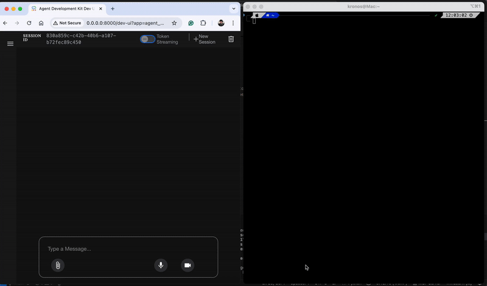

# a2a_development
A Python project showcasing practical scripts and experiments using Google’s Accessory Development Kit (ADK), Large Language Model (LLM) agents, and Model Context Protocol (MCP).



## Overview
This repository serves as a showcase of my hands-on work with Google’s ADK, designed for potential employers and collaborators. It features Python scripts that demonstrate how to run LLM agents with the ADK, as well as an example that combines the ADK with the Model Context Protocol (MCP) for enhanced context handling.

## Features
- LLM Agent Scripts: Examples of running large language models as agents via Google’s ADK.
- ADK + MCP Integration: A sample script showing how to combine Google’s ADK with Model Context Protocol for advanced use cases.
- Modern Python Project Structure: Built and managed using uv, ensuring fast and reproducible environments.

## Getting Started
- Prerequisites
- Python 3.x
- uv

## Installation

Clone the repository:

``` bash
git clone https://github.com/randomMatrix77/a2a_development.git
cd a2a_development
```

Install dependencies using uv:

``` bash
uv sync
```

Usage

``` bash
uv run adk web
```


## About
This repository demonstrates my proficiency in integrating modern AI tooling (LLMs), Google’s ADK, and emerging protocols like MCP. It is intended as a portfolio piece for job applications and technical showcases.